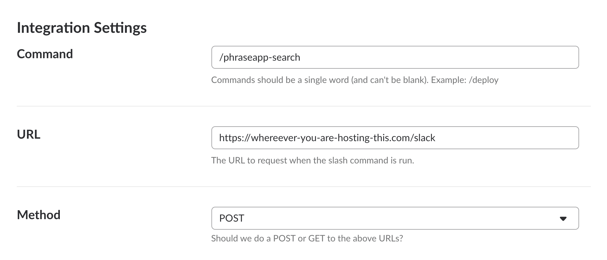

# PhraseApp Search

PhraseApp does not offer a full text search across multiple projects. You usually have one project per frontend or micro service. If you have a text and want to see in which project it is defined, you have to go through all the projects manually which is a time consuming and annoying procedure.

## Features

This project will give you two things: A very simple API to search for strings and a Slack Bot.

### Simple `GET` API

Just call it with `text` as an URL parameter.

#### Example Request

```
curl "http://localhost:8080/?text=Add%20Payment%20method"
```

#### Example Response

This will give you a list of results, e.g.

```
{
  "resultList": [
    {
      "keyName": "payment_add_payment_method",
      "keyId": "123123_your_key_id",
      "locale": "en-US",
      "localeId": "123123_your_locale_id",
      "projectId": "123123_your_project_id",
      "projectName": "Your Project Name",
      "text": "Add Payment Method"
    }
  ]
}
```

### Slack Bot

This project also includes a Slash Command for Slack. You can use it like this.

```
/phraseapp-search The string you are looking for.
```


It is available under `https://whereever-you-are-hosting-this.com/slack`. Your settings should look something like this.



You can also pass the Slack token as an environment variable called `SLACK_TOKEN`. If the token configured in Slack does not equal the token configured by you, it will return a 401 and the Slack Slash Command will not work.

## How to get started

* Go to your settings page in PhraseApp and create a new access token [here](https://phraseapp.com/settings/oauth_access_tokens).
* When you run this project you need to pass your access token as an environment variable called `PHRASE_APP_ACCESS_TOKEN`.

### Docker

The project can easily be build into a Docker container with the provided Dockerfile

```
docker build --rm -t phaseapp-search .
docker run -d -p 8080:8080 phaseapp-search
```